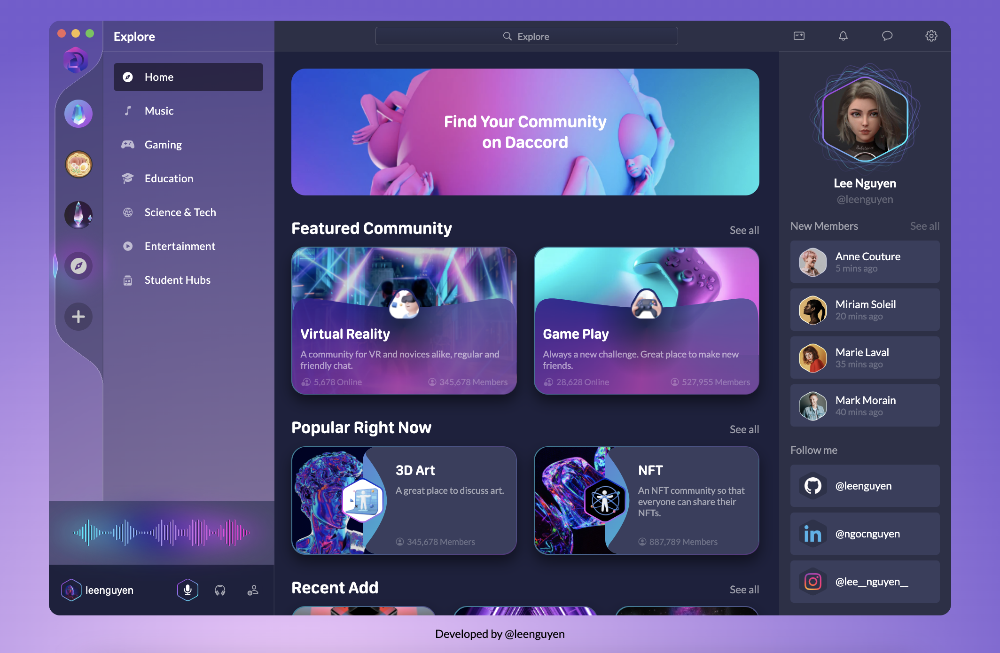

## Daccord - awesome UI 🎉

  

💡 [Figma Design][design]

🥷 Developed by [@leenguyen][developer]

**Technologies** 🛠

- HTML, JS, SCSS
- Convert SVG absolute clip-path to relative: thanks to [clip-path converter](https://yoksel.github.io/relative-clip-path/)

**_CSS tricks_**

- [clip-path](https://developer.mozilla.org/en-US/docs/Web/CSS/clip-path)

[design]: https://www.figma.com/community/file/1116248614926294639
[developer]: https://github.com/sLeeNguyen
